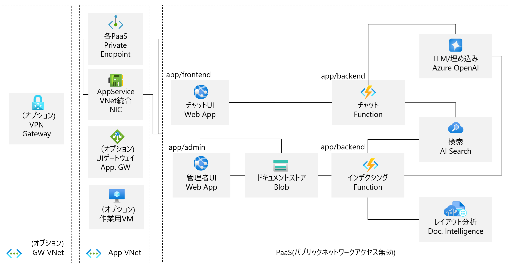

# "Minimum Viable Sample" 機能最小限な社内文書RAGチャットボット(プライベートネットワーク縛り)

## 背景

- 社内文書を情報源とし、プライベートネットワークで使うRAGチャットボットの需要が多い
- 企業ITに関わる人が手を動かす、良い機会になっている
- しかし、多くのRAGチャットボットのサンプルはニーズとともに複雑化しており、理解に時間がかかる
- 最低限の機能で理解しやすさにフォーカスしたサンプルがあってもよい

## 機能概要

- チャットUI (Azure Web App, Python, Streamlit)
  - QAチャット、および情報源ドキュメントのダウンロード
  - 一問一答。チャット履歴を加味した回答はしない
- バックエンド (Azure Functions, Python)
  - チャット
    - /chatエンドポイントへPOSTされた質問に回答
    - ストリーム対応
  - インデクシング
    - ドキュメントストアへのファイルアップロードをトリガーに実行
    - Document Intelligenceでレイアウト分析、Markdown化
    - Markdownをチャンク化、ベクトル埋め込みし、AI Searchのインデックスへ登録
- 管理UI (Azure Web App, Python, Streamlit)
  - ドキュメントストアへのファイルアップロード
- 検索 (Azure AI Search)
  - RAGインデックス検索
- ドキュメントストア (Azure Blob)

## 前提条件

以下のソフトウェアを導入でき、必要な通信を妨げるプロキシーなどがないこと。

- Azure Developer CLI 1.11.0以降
- Azure CLI 2.67.0以降
- VS Code 1.96.2以降
  - [拡張](.vscode/extensions.json)
- Python 3.11.x

## 利用手順

### ネットワークアドレス空間の確認

接続するプライベートネットワークに合わせ、仮想ネットワークのアドレス空間とサブネット範囲、クライアントアドレスプールを調整してください。設定は[main.bicep](infra/main.bicep)の下記moduleにあります。

- appVnet
- gwVnet(VPNを使う場合)
- virtualNetworkGateway(VPNを使う場合)

### 環境構築

リポジトリのルートディレクトリで、以下のAzure Developer CLIコマンドを実行します。

`azd provision`

以下はオプションを導入する場合の設定です。`azd provision`の前に実行してください。

#### 作業用VMが必要な場合

`azd env set USE_VM true`

仮の管理者名とパスワードが自動設定されます。[リセット](https://learn.microsoft.com/ja-jp/troubleshoot/azure/virtual-machines/windows/reset-rdp)して使ってください。 パスワードはKey Vaultへの保管をおすすめします。

#### VPN Gatewayが必要な場合

`azd env set USE_VPN true`

企業でプライベートネットワークという条件ではExpressRouteが整備されているケースが多数と思われますが、テストなどでVPNが必要な場合に使ってください。

#### Application Gatewayが必要な場合

`azd env set USE_APPGW true`

Application GatewayのフロントエンドはHTTPのみ構成されます。Application Gatewayを介したHTTPS構成には[多くの考慮](https://learn.microsoft.com/ja-jp/azure/architecture/best-practices/host-name-preservation)が必要です。「最小限」というコンセプトから外れるため、HTTPS構成は割愛します。

### アプリケーションのデプロイ

環境構築を実行するマシンが構築タイミングでプライベートネットワークに接続していないケースを考慮し、`azd up`での「環境構築とアプリケーションデプロイメントの同時実行」は行いません。アプリケーションは[VS Code拡張](https://github.com/Microsoft/vscode-azureappservice)などでデプロイしてください。

なお、ドキュメントのインデクシング前にAI Searchのインデックス設定が必要です。[インデックス設定Pythonスクリプト](scripts/search/create_index.py)を実行してください。

### 環境削除

`azd down --purge`

## 補足事項

- サンプルアプリケーションでは使っていませんが、拡充に備え、よく使われるサービスは`azd provision`の中で作成しています。
  - Cosmos DB (Serverless)
  - Key Vault
- Azure外での名前解決は、適宜DNSやhostsを設定してください。
  - 参考: [hostsを作るbashスクリプト](scripts/util/hosts/gen_hosts.sh)
  - 参考: [hostsを作るPowerShellスクリプト](scripts/util/hosts/gen_hosts.ps1)
- App Service/Azure SDK for Python/Application Insightsの自動計装に[現在不具合がある](https://github.com/Azure/azure-sdk-for-python/issues/37790#issuecomment-2448213164)ため、コードで計装しています。
- 各リソースの診断設定は未設定です。必要に応じて設定してください。

## 拡充例

- 認証
  - ユーザー認証
  - バックエンド認証
- 認可
  - ユーザーやグループに応じたインデックス、ドキュメントの参照権限
- チャット履歴のCosmos DBへの保存、履歴を文脈とした質問の作成
  - ユーザー認証が前提
- ドキュメントストアの管理機能追加
  - バルク投入
  - スケジュール投入
  - ファイル削除に合わせたインデックス削除
- 検索の最適化
  - チャンクの大きさやオーバーラップ範囲
  - ドキュメント構造に合わせた前処理
  - AI Search セマンティックランカーの利用
- 回答の最適化
  - プロンプトのチューニング
- ガードレール
  - 悪意ある入出力からの保護
- プロンプトへの依存度を下げる、回答内容や構造をできるかぎり決定的にする
  - function calling
  - structured output
- 性能拡張性の向上
  - Blobトリガーから別手段へ
    - 定石であるEvend Grid システムトピックを使ったトリガーは、[現状プライベートネットワークでは使えない](https://learn.microsoft.com/ja-jp/azure/event-grid/configure-private-endpoints)
    - Blobのアップロード時、同時にQueueに書いてQueueトリガーにするなどを検討する
  - ひとつのApp Serviceプランを機能別に分離
  - 複数インスタンス化
    - セッションの外部ストアへの保管とインスタンス間での共有
      - Streamlitでは[現在サポートされない](https://github.com/streamlit/streamlit/issues/5849)ため、UIフレームワークは再考が必要
  - ひとつのストレージアカウントを用途別に分離
- ユーザー体験の向上
  - チャットのストリーミングの調整、有効/無効の検証
- 保守性の向上
  - 共通機能、関数のモジュール化
  - Python仮想環境をアプリケーション別に分離
  - モノレポに向いたパッケージ管理システムの採用
    - poetryなど
  - テストの追加
